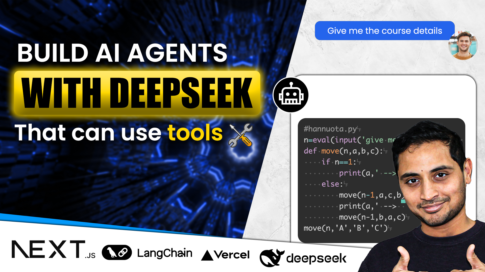

# AI Agent Tutorial

Hi, This forked github repo is based on langchain's next.js template, but I've adapted it to replace OpenAI with Deepseek LLM using Groq's FREE API portal. 

## What is Different in this Repo from the source?
- Use of ChatGroq instead of OpenAI (YOU CAN USE THIS FOR FREE)
- Use of HuggingFaceInferenceEmbeddings instead of OpenAIEmbeddings (YOU CAN USE THIS FOR FREE)
- Practical example of Training an AI Bot and using AI Agent tools based on a [Neuroscience course website](https://sidwarrier.com/neuromastery).

## Setup

Prerequisites:
- Create a Free account on https://console.groq.com/
- Create an API key 
    - (copy the key, to use below in the .env file)
- Create a Free account on https://huggingface.co/
- Create an Access token from https://huggingface.co/settings/tokens 
    - (copy the key, to use below in the .env file)
- Create a Free account on http://supabase.com/
- Create a project on Supabase
    - (copy the Project URL and API Key, to use below in the .env file)

Steps to run this repo:
- Clone this repo
- Duplicate the .env.example to .env file and paste the keys generated in the prerequisites as described above
- run `npm i`
- run `npm run dev`
- Open http://localhost:3000/ 

Files to edit to build your own custom bot (Optional):
- Update your [prompt](app/api/prompt.ts)
- Update the [RAG Document](data/NeuroMastery-coursedetails.ts) which will get uploaded to your vectorstore in Supabase.
- Update the AI Agent tools in a single file [tools.ts](app/api/tools.ts)

Tools used:
- Langchain 
- Next.js 
- Deepseek 
- Supabase

Deploy:
- Currently not covered in this repo, but you can use Netlify to deploy it to your website if needed.

### Reference: LangChain + Next.js Starter Template
Source Repo Reference: https://github.com/langchain-ai/langchain-nextjs-template